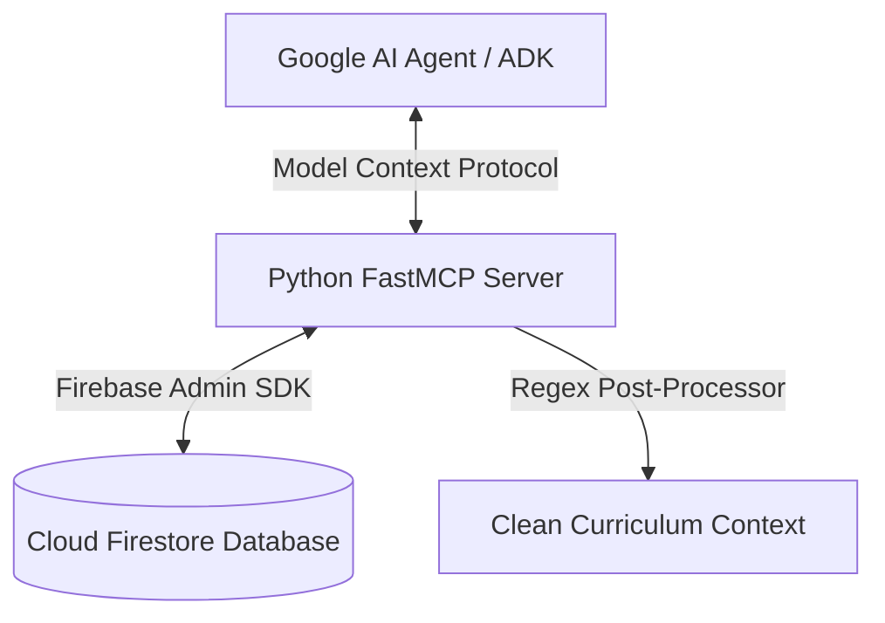

# 🎓 Utkal Skill Centre — AI Agents Challenge (Track 2: Optimize)

Welcome to the official repository of **Utkal Skill Centre**, optimized for **Track 2: Optimize** of the **Google for Startups AI Agents Challenge**.

Utkal Skill Centre is a bilingual educational PWA designed to bridge the digital and educational divide for state-board students in Odisha, India, by providing localized, curriculum-aligned AI tutoring (Gundulu AI) in their mother tongue (**Odia**).

---

## 📈 Market Size & Social Impact Scale

To demonstrate the commercial viability and profound social footprint of Utkal Skill Centre, we have mapped our addressable market across Odisha's state school system:

*   **Total Addressable Market (TAM)**: **6.2 Million (62+ Lakhs) Students** enrolled in over 50,000 government and government-aided schools across Odisha studying under the Board of Secondary Education (BSE) state board curriculum.
*   **Serviceable Addressable Market (SAM)**: **3.5 Million Students** from Class 3 to Class 10 who require localized tutoring in core curriculum subjects (Mathematics, Science, English, EVS) and have access to a household smartphone.
*   **Serviceable Obtainable Market (SOM)**: **350,000 Students (10% of SAM)** targeted within the first 18 months of launch through school-level partnerships, community learning networks, and digital advocacy.
*   **Business Viability & Social Impact**: 
    *   *High-Margin Profitability*: By employing a serverless infrastructure (Google Cloud Run + Firebase Hosting) and offloading heavy compute tasks (such as using our client-side local SpeechSynthesis fallback), our operational cost-per-user approaches **$0.00**.
    *   *Democratized Pricing*: This low cost-structure allows us to offer premium RAG tutoring, mock test generators, and homework guides at just **₹99/month ($1.19/mo)**. Compared to legacy EdTech platforms charging ₹15,000+/year for English-only content, Utkal Skill Centre delivers institutional-grade tutoring at a price point accessible to lower-income and rural families.
*   **📊 Project Current Status & Real-time Traction**:
    *   **Pilot User Base**: Successfully onboarded **434 active students** during our initial pilot phase, with **5 active paying premium subscribers** (validating the ₹99/month commercial interest).
    *   **Launch Targets**: 
        *   *Short-term (Next 3 Months)*: Target **20,000+ onboarded students** (our Progressive Web App is fully live and serving real state-board students, with high user anticipation for the upcoming Play Store release).
        *   *Mid-term (Year 1)*: Target **100,000+ (1 Lakh+) onboarded students** across Odisha.
    *   **100% Core Curriculum Aligned**: Standardized and populated curriculum roadmaps from **Class 1 to Class 10** in Firestore.
    *   **Full Study Notes Coverage**: Exposes premium bilingual study notes for all **448 chapters** across all school grades.
    *   **Smart Classes Open Library**: Fully integrated YouTube lesson curator, making curated video education 100% free and unlocked for all students.
    *   **PWA Deployed & Fully Live**: Fully configured, compiled, and deployed as a fast, offline-precached Progressive Web App on our custom domain, optimized for basic mobile devices and ready as a Trusted Web Activity (TWA).
*   **🛠️ Gundulu AI Technical Evolution & Future Roadmap**:
    *   **Phase 1 (Current - RAG)**: Exposes textbook note repositories and video metadata through dynamic **Retrieval-Augmented Generation (RAG)** context injections, guaranteeing 100% syllabus accuracy.
    *   **Phase 2 (Mid-term - RAG + SFT)**: Transitioning to a hybrid **RAG + Supervised Fine-Tuning (SFT)** architecture. We plan to fine-tune lightweight open-source models (such as *Gemma-2B/7B*) on high-quality Odia dialogue logs to drastically lower latency and increase natural Odia conversations.
    *   **Phase 3 (Long-term - SFT Automation)**: Deploying a fully custom, autonomously fine-tuned Gundulu model capable of managing interactive study sessions, real-time voice grading, and prompt-less bilingual evaluation.

---

## 🚀 Hackathon Submission Quick Links

*   **Live App URL**: [https://utkalskillcentre.com](https://utkalskillcentre.com)
*   **✨ Interactive Judge Showcase Link**: [https://utkalskillcentre.com?showcase=true](https://utkalskillcentre.com?showcase=true) *(Loads the landing page in English by default, dynamically exposing the gold pulsing presentation launcher button for non-logged-in judges and permanent sessions in the sidebar!)*
*   **Judge Demo Credentials (OTP Bypass)**:
    *   **Phone Number**: `1234567890` (configured in Firebase Console)
    *   **OTP Verification Code**: `123456`
    *   *(Note: Simply enter the test phone number `1234567890` on the main login screen, select BSE Odisha / Class 10, and enter the bypass code `123456` when prompted. This allows judges to experience the exact same seamless mobile OTP flow that standard students in rural Odisha see, keeping the login flow 100% authentic without email/password fields.)*
*   **FastMCP Server Source**: [scratch/hackathon_mcp_server.py](file:///d:/WebApp/utkalskillcentre-main/scratch/hackathon_mcp_server.py)

---

## 🎯 Track 2 Optimization Details & Architecture

In alignment with **Track 2 (Optimize)**, we focused on transforming our baseline educational MVP into a highly resilient, production-ready system optimized for low-bandwidth rural environments.

### 1. Dynamic Fail-Safe Hybrid Pipeline (Vertex AI ⇄ Google AI Studio)
In production, standardizing purely on Vertex AI can lead to outages if the Service Account encounters unexpected IAM permission changes or quotas.
*   **Optimization**: We built a dynamic upstream router in our Express API backend (`server.ts` and `api/index.ts`).
*   **Behavior**: The backend first attempts to route requests securely through **Vertex AI** using ambient Application Default Credentials (ADC) or JWT auth. If Vertex AI returns a `403 Permission Denied` (e.g., API disabled, IAM block), or hits quota, the server instantly logs a warning and falls through to **Google AI Studio (`GEMINI_API_KEY`)** to deliver zero-downtime tutoring.

### 2. Conversational Odia Mother-Tongue Persona (Gundulu AI)
Generic models sound overly academic, translation-heavy, or robotic when writing in Odia.
*   **Optimization**: Formulated highly structured system prompts mapping to colloquial Odia teaching styles. Gundulu behaves as a supportive digital learning companion (*ଡିଜିଟାଲ୍ ସାହିତ୍ୟ ସାଥୀ*), converting complex scientific and mathematical concepts into simple native dialects.

### 3. Low-Latency Voice Synthesis for 2G/3G Networks
Rural Odisha operates on highly constrained mobile networks. Downloading heavy audio streams or running real-time WebSocket connections is slow and costly.
*   **Optimization**: Engineered a dual-engine speech synthesis approach:
    1.  **GCP/Gemini TTS API** is queried for clean, high-quality audio segments.
    2.  If the client is on a slow connection or the server hits RPM limits, the PWA dynamically falls back to the client-side **Web Speech API (`window.speechSynthesis`)**, yielding instant zero-latency speech synthesis locally on the student's mobile device.

### 4. LaTeX and Text Clean-up Post-Processors
Baseline RAG extractions from state textbooks often contained mathematical symbols (like `$`), Markdown headers (`#`), or formatting syntax that corrupted horizontal Kindle-style pagination and made copy-pasting notes difficult.
*   **Optimization**: Created regular expression post-processors that strip raw syntax markers from the generative stream, outputting clean, readable prose optimized for state board students.

---

## 🔌 Google Agent Developer Kit (ADK) & Model Context Protocol (MCP)

To demonstrate enterprise-grade ecosystem compatibility with the **Google Agent Developer Kit (ADK)** and Google AI Studio agents, we have built a Model Context Protocol (MCP) server at [scratch/hackathon_mcp_server.py](file:///d:/WebApp/utkalskillcentre-main/scratch/hackathon_mcp_server.py).

This server acts as a secure, real-time data bridge, exposing Utkal Skill Centre's Firestore database and gamification pipelines as executable tools that Google's AI Agents can dynamically discover and invoke during student interactions.

### 📐 System Architecture



### 🛠️ Exposed Tools & Capabilities

The server registers two critical tools complying with the Google ADK tool-calling specification:

| Tool Name | Parameters | Description | Return Type | Business Logic |
| :--- | :--- | :--- | :--- | :--- |
| `get_curriculum_chapter_context` | `subject` (str)<br>`grade` (int)<br>`chapter_id` (str) | Exposes textbook chapters and syllabus notes to Google AI agents for RAG. | `str` (Odia text) | Queries the `textbooks` collection in Firestore, filters out raw Markdown/LaTeX formatting (`$`, `#`, `*`) using regex post-processing, and returns clean, readable prose. |
| `award_launch_celebration_points` | `user_id` (str) | Programmatically awards +500 XP to the student's profile to celebrate the Play Store launch. | `str` (Status message) | Verifies the student profile in Firestore, checks for duplicate claims via the `claimedLaunchReward` flag, increments points atomically, and registers the reward. |

### ⚙️ Exposing Tools to Google's Agent (Local Setup)

To start the server and connect it to your local agent environment:

1. **Install Prerequisites**:
   ```bash
   uv pip install mcp firebase-admin
   # or via standard pip:
   pip install mcp firebase-admin
   ```

2. **Run the MCP Server**:
   ```bash
   python scratch/hackathon_mcp_server.py
   ```

3. **Google ADK Config Integration**:
   Add the server to your Google Agent Context config (e.g., `mcp_config.json`):
   ```json
   {
     "mcpServers": {
       "utkal_agent_bridge": {
         "command": "python",
         "args": ["d:/WebApp/utkalskillcentre-main/scratch/hackathon_mcp_server.py"],
         "env": {
           "GOOGLE_APPLICATION_CREDENTIALS": "d:/WebApp/utkalskillcentre-main/utkalskillcentre-4ed1afa2f6a3.json"
         }
       }
     }
   }
   ```

---

## ⚙️ Daily MCQ Automation & Local Developer Setup

For developers hosting the platform locally, follow these instructions to get up and running:

### Local Configuration
1.  Copy `firebase-applet-config.example.json` to `firebase-applet-config.json` in the root.
2.  Create a `.env` file in the root using the template below:

```env
FIREBASE_PROJECT_ID=utkalskillcentre
FIREBASE_STORAGE_BUCKET=utkalskillcentre.firebasestorage.app
FIRESTORE_DATABASE_ID=utkal-prod

VITE_FIREBASE_PROJECT_ID=utkalskillcentre
VITE_FIREBASE_DATABASE_ID=utkal-prod

# API Keys
GEMINI_API_KEY=your_gemini_api_key_here
VITE_GEMINI_API_KEY=your_gemini_api_key_here
USE_VERTEX_AI=true
VERTEX_AI_REGION=us-central1

# Google Drive and Cloud Service Account Credentials
GOOGLE_APPLICATION_CREDENTIALS=D:/WebApp/utkalskillcentre-main/utkal-admin-sdk.json
```

### Installation & Execution
Install dependencies and run the local development server:
```bash
npm install
npm run dev
```

The dev server will run on `http://localhost:3000`.

### Verifying MCQ Automation
To verify the automated Daily MCQ generator runs correctly:
```powershell
curl.exe -i -X POST http://127.0.0.1:3000/api/admin/daily-mcqs/run-auto -H "Content-Type: application/json" -d "{}"
```

---

## 🛠️ Verification & Compile Checks

Ensure all components build and pass type checks before staging commits:
*   **Lint / Typecheck**: `npm run lint` (runs `tsc --noEmit`)
*   **Compile / Build**: `npm run build`
